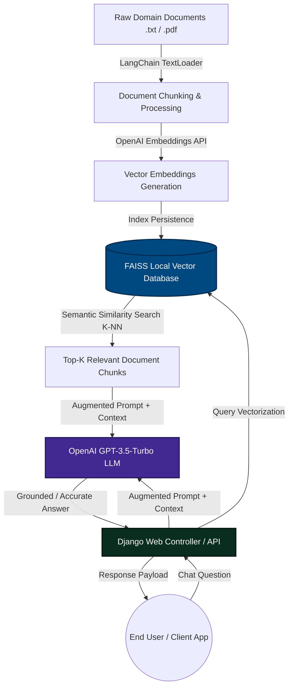

<div align="center">

# 🤖 Enterprise RAG Chatbot Service
### Retrieval-Augmented Generation (RAG) Pipeline Built with Django, LangChain, FAISS & OpenAI


---

<p align="center">
  <a href="#-overview">Overview</a> •
  <a href="#-rag-architecture--pipeline">Architecture</a> •
  <a href="#-tech-stack">Tech Stack</a> •
  <a href="#-getting-started">Getting Started</a> •
  <a href="#-how-it-works-embeddings--retrieval">How It Works</a> •
  <a href="#-contact--author">Author</a>
</p>

</div>

---

## 📖 Overview

The **Enterprise RAG Chatbot Service** is an intelligent conversational artificial intelligence system designed to answer domain-specific questions with zero hallucination. By integrating **Django** with **LangChain** and a local **FAISS (Facebook AI Similarity Search) Vector Database**, this application empowers Large Language Models (LLMs) to retrieve relevant facts directly from proprietary document corpora before generating responses.

Instead of relying solely on parametric LLM training weights, this service implements a complete **Retrieval-Augmented Generation (RAG)** pipeline: embedding raw text documents, indexing them in multi-dimensional vector space, performing semantic nearest-neighbor similarity searches, and feeding retrieved context into **OpenAI GPT** models via structured QA chains.

---

## 🏗️ RAG Architecture & Pipeline



### ✨ Key Capabilities:
* 🧠 **Zero-Hallucination Retrieval:** Dynamically grounds LLM responses in verified local knowledge sources using semantic similarity matching, ensuring factual accuracy for enterprise applications.
* ⚡ **High-Speed Vector Search:** Uses local FAISS indices for sub-millisecond nearest-neighbor vector retrieval without relying on slow or expensive external vector database clusters.
* 🔗 **Modular LangChain Integration:** Leverages LangChain's `RetrievalQA` chains and document loaders to orchestrate seamless data flow between document storage, vector embedding, and chat inference.
* 🌐 **Robust Django Backend:** Wraps the entire AI pipeline in a production-grade Django backend, providing clean URL routing, session management, and scalability.

---

## 🛠️ Tech Stack

| Component | Technology / Library | Description |
| :--- | :--- | :--- |
| **Backend Framework** | Django | High-level Python web framework |
| **LLM Orchestration** | LangChain / LangChain Community | Framework for developing applications powered by language models |
| **Vector Database** | FAISS (Facebook AI Similarity Search) | Efficient similarity search and clustering of dense vectors |
| **Embeddings & LLM** | OpenAI API (`text-embedding-ada-002` & `gpt-3.5-turbo`) | State-of-the-art semantic embedding and conversational generation |
| **Database** | SQLite / PostgreSQL | Relational storage for user sessions and chat history |

---

## 🚀 Getting Started

Follow these steps to set up and run the RAG chatbot pipeline locally on your workstation.

### Prerequisites
* [Python 3.9 or higher](https://www.python.org/downloads/)
* An active [OpenAI API Key](https://platform.openai.com/api-keys)

### 1️⃣ Clone the Repository
```bash
git clone https://github.com/ahmedraheed/chat_rag.git
cd chat_rag
```

### 2️⃣ Create Virtual Environment & Install Dependencies
```bash
# Create virtual environment
python -m venv venv

# Activate environment (Linux / macOS)
source venv/bin/activate
# Activate environment (Windows PowerShell)
.\venv\Scripts\Activate.ps1

# Install requirements
pip install --upgrade pip
pip install -r requirements.txt
```

### 3️⃣ Set Up Environment Variables
Create a `.env` file in the project root or configure your Django `settings.py` environment:
```env
OPENAI_API_KEY=sk-your-actual-openai-api-key-here
DEBUG=True
SECRET_KEY=your-django-secret-key
```

### 4️⃣ Prepare Knowledge Base & Generate Vector Index
Place your domain text files inside `chat/docs/` (e.g., `your_doc.txt`). Then initialize the vector database by running:
```bash
python manage.py shell
>>> from chat.rag_utils import create_vector_store
>>> create_vector_store()
>>> exit()
```
*This command reads your document, calls OpenAI to compute high-dimensional vector embeddings, and saves the index locally into `chat/faiss_index`.*

### 5️⃣ Run the Django Server
Apply database migrations and launch the web server:
```bash
python manage.py migrate
python manage.py runserver
```
Navigate to `http://127.0.0.1:8000` in your browser to interact with the RAG chatbot! 🎉

---

## 📐 How It Works: Embeddings & Semantic Retrieval

### 1. Document Chunking & Vectorization
When a document is ingested, LangChain converts words into dense numerical vectors $\vec{v} \in \mathbb{R}^{1536}$ using OpenAI's embedding model. Words and concepts with similar semantic meanings map to adjacent points in multi-dimensional space.

### 2. FAISS Nearest Neighbor Search
When a user submits a question $Q$, the query is converted into an embedding vector $\vec{q}$. FAISS computes the Euclidean distance or Cosine similarity against all document chunks in the index:

$$\text{Similarity}(\vec{q}, \vec{d_i}) = \frac{\vec{q} \cdot \vec{d_i}}{\|\vec{q}\| \|\vec{d_i}\|}$$

The top $K$ most similar chunks are retrieved and injected into the LLM system prompt as verified context:
```text
System Prompt: Answer the user's question using ONLY the following verified context:
[Retrieved Chunk 1] ...
[Retrieved Chunk 2] ...

User Question: {prompt}
```

---

## 📂 Project Directory Structure

```text
chat_rag/
├── chat/
│   ├── docs/            # Raw text knowledge base documents for ingestion
│   ├── faiss_index/     # Serialized FAISS local vector store (index.faiss, index.pkl)
│   ├── migrations/      # Django database schema migration scripts
│   ├── rag_utils.py     # Core RAG engine: document embedding, FAISS indexing & RetrievalQA chain
│   ├── views.py         # HTTP endpoints handling user chat queries and response rendering
│   ├── models.py        # Django ORM models
│   └── urls.py          # Application route definitions
├── rag_chat/            # Django project settings, ASGI/WSGI configuration, root URL routing
├── manage.py            # Django command-line administration utility
├── db.sqlite3           # Local development database
└── README.md            # Project documentation
```

---

## 🤝 Contributing & License

Contributions, feature additions, and optimizations are welcome!

1. Fork the Project
2. Create your Feature Branch (`git checkout -b feature/AddPDFLoader`)
3. Commit your Changes (`git commit -m 'Support multi-document PDF ingestion in RAG pipeline'`)
4. Push to the Branch (`git push origin feature/AddPDFLoader`)
5. Open a Pull Request

---

## 👤 Contact & Author

**Ahmed Rasheed (`ahmedraheed`)**
* **Role:** Software Engineer & Data Scientist (4+ Years Experience)
* **GitHub:** [@ahmedraheed](https://github.com/ahmedraheed)
* **Specialization:** Enterprise Backend Systems, Deep Learning & RAG LLM Architectures
